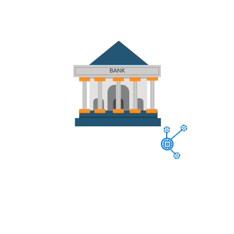

  
 

<h1 align="center">
    
</h1>

<h4 align="center"> 
	🚧  Project 6º Semestre Uninove 🚧
</h4>

## 💻 Sobre o projeto

🧭 Projeto desenvolvido utilizando Laravel, versão 5.8 e PHP 7.3, arquitetura simples em MVC, a qual é possível realizar inserção de dados e contém uma API consumindo dados para cotações de moedas.

---

## ⚙️ Funcionalidades

- [x] Adicionar usuários
- [x] Atualizar dados
- [x] Exlcuir usuários
- [x] API externa

---

## 🛠 Tecnologias

As seguintes ferramentas foram usadas na construção do projeto:

- **[PHP](https://www.php.net/manual/pt_BR/intro-whatis.php)**
- **[Laravel](https://laravel.com/)**
- **[Bootstrap](https://getbootstrap.com/)**